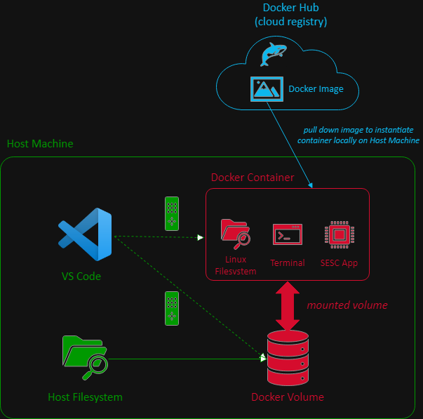

# CS 6290 (HPCA) Docker + VS Code Project Setup and Debugger

## Introduction

This repository is a collection of resources pertaining to setting up the [SESC](https://sesc.sourceforge.net/) application for projects in OMSCS course ***High Performance Computer Architecture (HPCA)***, CS 6290.

The net result is a [Docker](https://docs.docker.com/)-based development environment for editing, running, and debugging the SESC app, summarized as follows:

**CAVEAT**: This setup assumes a local ***x86-based*** client/host device. Otherwise, if using ARM (e.g., Apple Silicon M1, M2, etc.), consult relevant resources and posts in Ed, etc., as the setup described in this guide may be otherwise problematic to deal with.

## Prerequisites

Prior to proceeding further, ensure that the following **dependencies** are installed locally on your client/host device:
  * [Docker Desktop](https://www.docker.com/products/docker-desktop/) (or equivalent Docker Engine) for containerization
    * On installation, this will also provide the underlying [Docker Engine](https://docs.docker.com/engine/) and [Docker Compose](https://docs.docker.com/compose/) command line tool
  * [VS Code](https://code.visualstudio.com/) for interaction with the source code and files

***Note***: For Windows client/host devices, when installing Docker Desktop, use the default/preselected [WSL 2](https://aka.ms/wsl) based installation settings (i.e., rather than Hyper-V). This is a Windows-specific sub-dependency which provides the underlying Linux-based virtualization layer.

Additionally, ensure the following VS Code extensions are installed:
  * [Remote Development extension pack](https://marketplace.visualstudio.com/items?itemName=ms-vscode-remote.vscode-remote-extensionpack)
  * [Docker](https://marketplace.visualstudio.com/items?itemName=ms-azuretools.vscode-docker)
  * [C/C++](https://marketplace.visualstudio.com/items?itemName=ms-vscode.cpptools)

***Note***: See [here](https://code.visualstudio.com/docs/remote/remote-overview) for more information regarding VS Code remote extension pack. Also, see [here](https://code.visualstudio.com/docs/languages/cpp) for more information regarding C/C++ development using VS Code.

Relevant files provided in this repository are referenced in subsequent sections/links. For expediency, you may either pull down or download this entire repository in order to access these files in a single/consolidated manner, or otherwise simply transfer these files on an ad hoc basis as needed.

## Environment Setup

On completed installation of the prerequisites, see the [Environment Setup](./env-setup.md) for further instructions regarding instantiating the Docker-based development environment, which contains a containerized version of the SESC app and related development tools (i.e., compiler and debugger).

## Debugging

On successful setup of the development environment (or equivalent), see the [Debugging Guide](./debugging-guide.md) for further information regarding configuring and using the debugger (i.e., for projects work).
