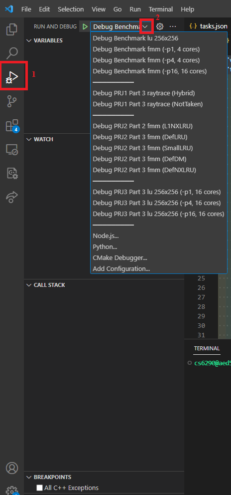
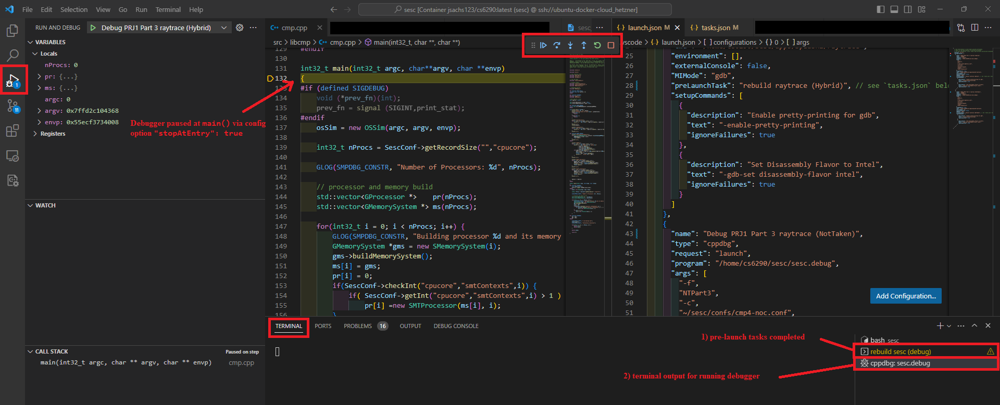
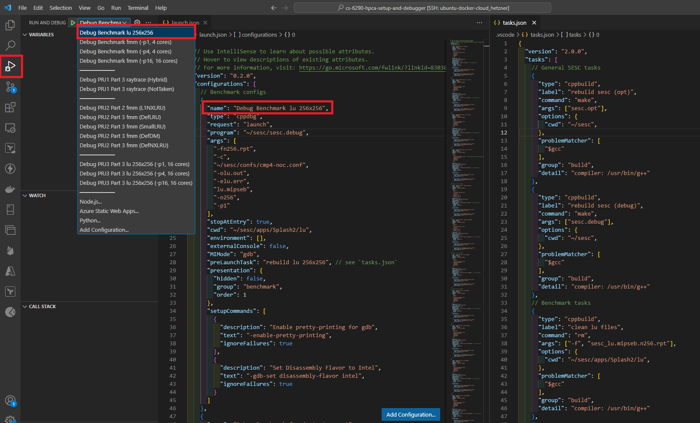

# Debugging Guide

## Document Outline

This guide is comprised of the following steps/sections:

```
- Initializing the Debugger Configurations
- Building the Source Code and Running the Debugger
- (Optional) Debugger Configurations "Anatomy"
```

***Note***: This guide ***assumes*** that the [prerequisites](./README.md#prerequisites) have been installed already. Furthermore, a setup comparable to that described in [Environment Setup](./env-setup.md) is also assumed here.

***Note***: In general throughout this guide, `~` and `/home/cs6290/` (i.e., home directory of user `cs6290`) refer to the ***same*** location within the ([Linux-based](https://en.wikipedia.org/wiki/Filesystem_Hierarchy_Standard)) file system of the Docker-containerized development environment.

## Initializing the Debugger Configurations

To add dropdowns to the debugger view in VS Code, open location `/home/cs6290/sesc` as a VS Code project/folder via the Docker-based container environment (accessed via VS Code), and then at this top-level folder (i.e., `/home/cs6290/sesc`) add the contents in subdirectory of this repo `/.vscode` (canonical folder name for VS Code project configurations) to corresponding top-level folder there (i.e., `/home/cs6290/sesc/.vscode/`).

This will correspondingly add dropdowns in the `Run and Debug` view of VS Code, as follows:

<center>

</center>

***Note***: The first section of the dropdown consolidates ***benchmarks*** (some of which are shared across projects), while the remaining sections of the dropdown are grouped on a project-specific basis (and additionally denoted by `Debug PRJ<...> Part <...> ....` on a per-part basis within a given project/grouping, as applicable). See corresponding project handouts and project-specific Ed FAQs (i.e., benchmark spreadsheets) for further reference.

## Building the Source Code and Running the Debugger

In the top-level `Makefile` (i.e., `~/sesc/Makefile`), note that there are two primary `make` targets (via corresponding [SCons](https://scons.org/)-based build system):
  * `make sesc.opt` (default, equivalent to running "bare" command `make`)
  * `make sesc.debug`

The project instructions (e.g., PRJ0) will instruct to perform the corresponding initial build commands. In particular, to build the initial source for SESC, run the following from the VS Code terminal (or equivalent):

```bash
cd ~/sesc
```
```bash
make
```

***Note***: This command may fail on the first attempt. Try re-running if ***errors*** occur (***warnings*** can be safely ignored otherwise).

Additionally, be advised that all of the provided debugger configurations require the corresponding simulation app to be compiled to MIPS prior to running the debugger (i.e., via corresponding command-line flag targeting files of general form `<...>.mipseb`). The project instructions will provide corresponding simulation-app specific targets, otherwise simply run the following commands to build all of the simulation apps simultaneously (e.g., `lu`, `raytrace`, `fmm`, etc.):

```bash
cd ~/sesc/apps/Splash2
```
```bash
make
```

To build the debug version of the SESC app (with corresponding debugger symbols), run the following commands:

```bash
cd ~/sesc
```
```bash
make sesc.debug
```

Finally, to launch the debugger, select the appropriate configuration from the dropdown (as per the previous section of this guide), and press key `F5` (or equivalently green "play" icon).

After the pre-launch tasks complete execution, it should redirect to the debugger stopped at program entry point `main()` (per configuration option `"stopAtEntry": true` in file `/.vscode/launch.json`):

<center>

</center>

From this point onwards, you can set breakpoints, watch expressions, etc. to examine the run-time behavior of the running SESC program.

***Caution***: In order to ***change***/***update*** the source file(s), first **stop** the debugger, **save** changes, and then re-launch the debugger. The pre-launch tasks will correspondingly delete the previously generated report file and then rebuild the executables (via corresponding `sesc.opt` and `sesc.debug` make targets as per file `/home/cs6290/sesc/Makefile`), in order to trace the correspondingly updated version of the SESC application accordingly. Failure to do so (i.e., modifying the file ***while the debugger is still running***) will result in a "stale" state of the application, and correspondingly yielding ***indeterminate behavior*** of the debugger tracing. Accordingly, the debugging symbols used by `gdb` (which the VS Code GUI-based debugger "wraps over") via make target `sesc.debug` in the debugger tracing are based on the most recently compiled version of the program, immediately prior to launching the `gdb`-based VS Code debugger process.

Additionally, note the following general ***remarks*** regarding using the debugger configurations as provided here:
  * Setting `"stopAtEntry": true` in `launch.json` will prevent the debugger from "falling through" if no downstream breakpoints are set (otherwise, if already set immediately prior to and/or immediately following launching of the debugger, then hit `F5` to proceed to the next-occurring breakpoint accordingly on initial pause in `main()`)
  * `tasks.json` is defined such that on each launch of the debugger, existing report files are removed, and then subsequently the `make` targets `sesc.opt` and `sesc.debug` are run (i.e., to reflect updated changes in modified source files), and furthermore corresponding reports are generated in respective simulation-app-specific directories (e.g., `sesc_raytrace.mipseb.HyPart3` and `sesc_raytrace.mipseb.NTPart3` are generated in `/home/cs6290/apps/Splash2/raytrace`, and so on)
  * In addition to changing the debugger dropdown selection, ensure to make corresponding modification in config files (of general form `cmp<...>-noc.conf`, located in `/home/cs6290/sesc/confs/`) as necessary as per project instructions (i.e., this is not otherwise automated/configured in the provided debugger configs here)

## *(Optional)* Debugger Configurations "Anatomy"

***Note***: For additional information regarding  configuring and using the VS Code debugger, see the following references:
  * https://code.visualstudio.com/docs/editor/debugging
  * https://code.visualstudio.com/docs/editor/variables-reference
  * https://code.visualstudio.com/docs/cpp/launch-json-reference
  * https://code.visualstudio.com/docs/cpp/config-linux

The dropdowns in the `Run and Debug` view of VS Code (as demonstrated previously in this guide) are configured directly in file `/.vscode/launch.json`, which provides the corresponding "launch" configurations to populate these dropdown entries. Furthermore, sub-"tasks" can be defined via `/.vscode/tasks.json` to enhance these launch configurations; in this particular context, the tasks are defined such that the old report is deleted and then the SESC app is rebuilt (for both compilation and debugging targets), immediately prior to launch of the VS Code debugger, thereby ensuring the most recently saved version of the source code is used when debugging.

***Note***: For demonstration purposes, this section will examine the "benchmarks" configurations group, however, this information is applicable to the other groups and launch configurations, without a corresponding loss of generality.

As a representative example, consider the first dropdown entry, `Debug Benchmark lu 256x256`, as follows:

<center>

</center>

This runs the following equivalent terminal command from location `~/sesc/apps/Splash2/lu`:

```bash
~/sesc/sesc.debug -fn256.rpt -c ~/sesc/confs/cmp4-noc.conf -olu.out -elu.err lu.mipseb -n256 -p1
```

via corresponding fields defined as follows (denoted below via comment `// <---`):

(`/.vscode/launch.json`)
```jsonc
{
  // Use IntelliSense to learn about possible attributes.
  // Hover to view descriptions of existing attributes.
  // For more information, visit: https://go.microsoft.com/fwlink/?linkid=830387
  "version": "0.2.0",
  "configurations": [
    // Benchmark configs
    {
      "name": "Debug Benchmark lu 256x256",
      "type": "cppdbg",
      "request": "launch",
      "program": "~/sesc/sesc.debug",        // <---
      "args": [                              // <--- (command-line arguments)
        "-fn256.rpt",
        "-c",
        "~/sesc/confs/cmp4-noc.conf",
        "-olu.out",
        "-elu.err",
        "lu.mipseb",
        "-n256",
        "-p1"
      ],
      "stopAtEntry": true,
      "cwd": "~/sesc/apps/Splash2/lu",       // <--- (current working directory)
      "environment": [],
      "externalConsole": false,
      "MIMode": "gdb",
      "preLaunchTask": "rebuild lu 256x256", // see `tasks.json` <--- (prelaunch task)
      "presentation": {                      // <--- (dropdown groups definition)
        "hidden": false,
        "group": "benchmark",
        "order": 1
      },
      "setupCommands": [
        {
          "description": "Enable pretty-printing for gdb",
          "text": "-enable-pretty-printing",
          "ignoreFailures": true
        },
        {
          "description": "Set Disassembly Flavor to Intel",
          "text": "-gdb-set disassembly-flavor intel",
          "ignoreFailures": true
        }
      ]
    },
    // ...
  ],
}
```

Furthermore, also as denoted above (i.e., via `// <---`), under setting `"presentation"`, note that this configuration is grouped under `"group": "benchmark"` and appears first in this group's list (i.e., `"order": 1`). Also note that defining the groups in this manner adds the corresponding bars/sections in the dropdown accordingly, adding an additional level of organization (i.e., rather than a "cluttered"/monolithic list of such launch configurations).

With respect to the ***prelaunch task***, as denoted above, this is defined correspondingly in `/.vscode/tasks.json`. Here, the relevant tasks are as follows (excerpts included here for expediency, with other tasks omitted via `// ...` for brevity):

(`/.vscode/tasks.json`)
```jsonc
{
  "version": "2.0.0",
  "tasks": [
    // General SESC tasks
    {
      "type": "cppbuild",
      "label": "rebuild sesc (opt)",                // <---
      "command": "make",
      "args": ["sesc.opt"],
      "options": {
        "cwd": "/home/cs6290/sesc",
      },
      "problemMatcher": [
        "$gcc"
      ],
      "group": "build",
      "detail": "compiler: /usr/bin/g++"
    },
    {
      "type": "cppbuild",
      "label": "rebuild sesc (debug)",              // <---
      "command": "make",
      "args": ["sesc.debug"],
      "options": {
        "cwd": "/home/cs6290/sesc",
      },
      "problemMatcher": [
        "$gcc"
      ],
      "group": "build",
      "detail": "compiler: /usr/bin/g++"
    },
    // Benchmark tasks
    {
      "type": "cppbuild",
      "label": "clean lu files",                    // <---
      "command": "rm",
      "args": ["-f", "sesc_lu.mipseb.n256.rpt"],    // <---
      "options": {
        "cwd": "/home/cs6290/sesc/apps/Splash2/lu", // <---
      },
      "problemMatcher": [
        "$gcc"
      ],
      "group": "build",
      "detail": "compiler: /usr/bin/g++"
    },
    {
      "label": "rebuild lu 256x256",                // <---
      "dependsOrder": "sequence",
      "dependsOn": [                                // <---
        "clean lu files",
        "rebuild sesc (opt)",
        "rebuild sesc (debug)",
      ],
    },
    // ...
  ],
}
```

Per above (with correspondingly annotated/commented `// <---`, for subsequent discussion), the ***general SESC tasks*** define the respective make targets (i.e., Bash commands `make sesc.opt` and `make sesc.debug`), both set to run from location `/home/cs6290/sesc` (i.e., `"cwd"`, the preset current working directory). However, these are not used directly as prelaunch tasks in `launch.json`, but rather constitute "sub-tasks" which are shared across other tasks accordingly.

Furthermore, launch-specific sub-tasks are similarly defined, e.g., `clean lu files`, which removes the previously generated report file via the following equivalent Bash command running in location (i.e., `"cwd"`, the preset current working directory) `/home/cs6290/sesc/apps/Splash2/lu`:

```bash
rm -f sesc_lu.mipseb.n256.rpt
```

With these sub-tasks defined appropriately, the "composite" task `rebuild lu 256x256` (i.e., that which is referenced by the aforementioned launch configuration, `Debug Benchmark lu 256x256`) simply performs these sub-tasks sequentially in turn (i.e., remove the old report, compile the SESC application, and then compile the debugger version of the application) immediately prior to launching the debugger.

The other launch configurations are similarly defined, with appropriately set `cwd` fields, project-task-specific report cleanups, etc.

In this manner, this allows a relatively streamlined "one-push" configuration, whereby any given launch will perform the appropriate upstream tasks, thereby obviating the need to run them manually from the command line in successive iterations of debugger launches.
