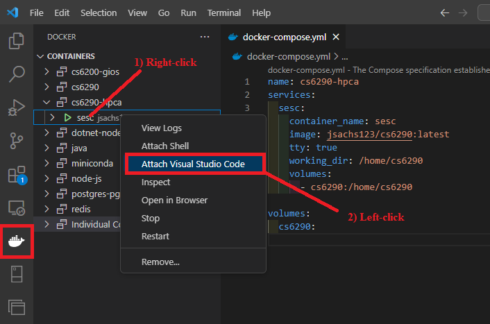
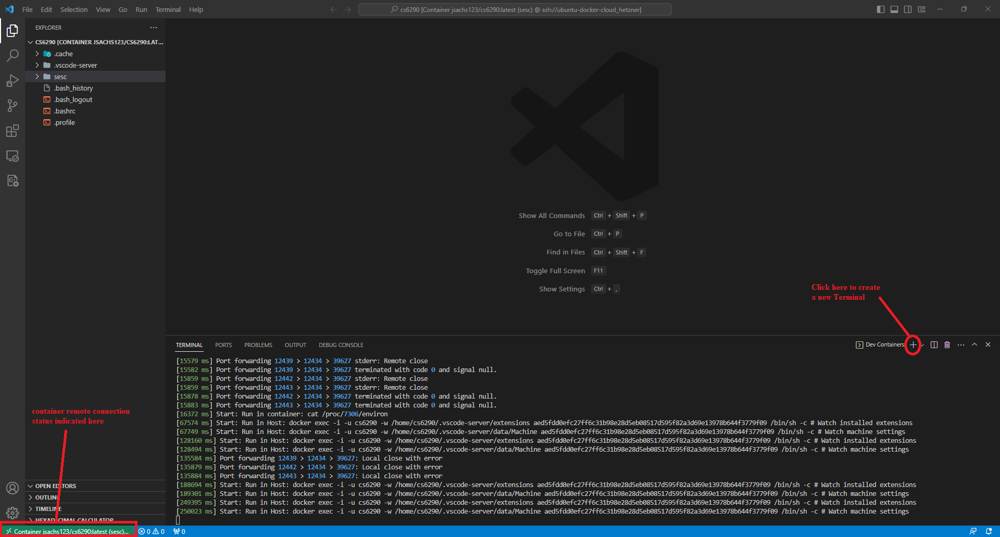
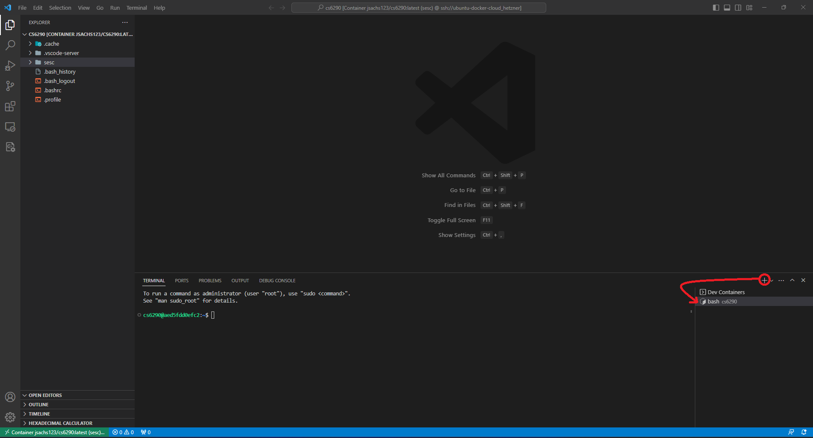
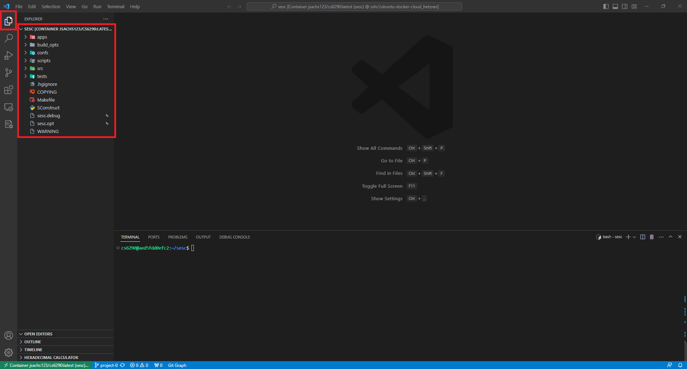
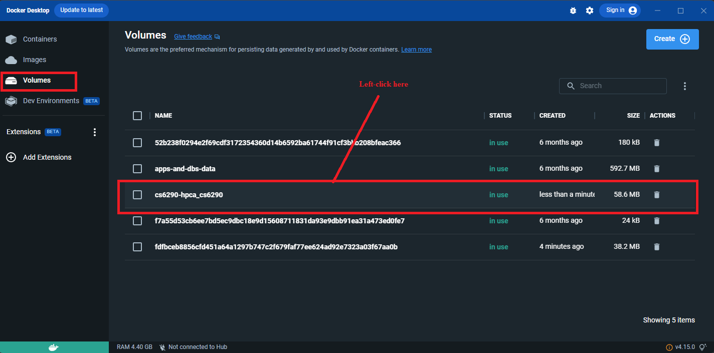
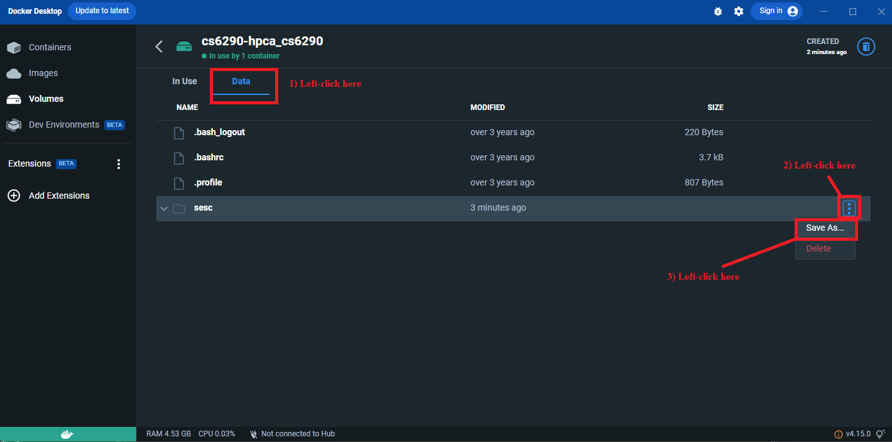

# Environment Setup

## Document Outline

This guide is comprised of the following steps:

```
- Setting Up the Docker Environment
- Using the Docker Environment
- Accessing the Volume-Mounted Project Files from the Host
- Postscript
```

***Note***: This guide ***assumes*** that the [prerequisites](./README.md#prerequisites) have been installed already.

***Note***: In general throughout this guide, `~` and `/home/cs6290/` (i.e., home directory of user `cs6290`) refer to the ***same*** location within the ([Linux-based](https://en.wikipedia.org/wiki/Filesystem_Hierarchy_Standard)) file system of the Docker-containerized development environment.

## Setting Up the Docker Environment

On your local machine, either create or copy the file `docker-compose.yml` provided in this repository (note that this filename is canonical).

Now, from the host OS terminal (e.g., zsh, bash, Git Bash, PowerShell, cmd, etc.), issue the following command from the folder/location in the host file system where `docker-compose.yml` now resides:

```bash
docker compose up -d
```

***Note***: If running an older version of Docker Compose, this command may fail on field `name`. If so, either upgrade Docker Compose version, or simply remove/omit this field (i.e., top-level `name: cs6290-hpca`) from file `docker-compose.yml` accordingly.

This will download the image from the canonical [Docker Hub](https://hub.docker.com/r/jsachs123/cs6290) container registry and then subsequently will create the development-environment container `sesc` (along with corresponding volume/storage `cs6290`), as specified in the file `docker-compose.yml`.

***Note***: The [volume](https://docs.docker.com/storage/volumes/) will provide the ability to persist the generated source files across containers, as well as for mutual access with the local machine (i.e., for subsequent projects submissions).

Lastly, to remote-connect into the container from your host-system OS, simply do the following via VS Code:

<center>

</center>

## Using the Docker Environment

On remote-connection into the container (it may take a minute or two to establish the connection, particularly on the first time), it should subsequently initialize inside the container with the working directory `/home/cs6290` set as the VS Code project/workspace, as follows:

<center>

</center>

<center>

</center>

***Note***: If VS Code Terminal is not present/visible, toggle it via keypress combo <code>Ctrl `</code> (backtick, directly above <code>Tab</code> key).

Additionally, to set the VS Code project/workspace directory to the `sesc` app itself, issue the following terminal command inside of the running container (via [VS Code CLI](https://code.visualstudio.com/docs/editor/command-line#_opening-files-and-folders)):

```bash
code ~/sesc
```

Resulting in the following:

<center>

</center>

With the `sesc` app opened in VS Code, you should now be able to proceed with the commands/instructions in projects P0, etc. using the VS Code Terminal, along with VS Code's Explorer to examine particular files of interest.

## Accessing the Volume-Mounted Project Files from the Host

As a closing remark, in order to access the files on your host OS (i.e., for submission to Canvas), this can be done via Docker Desktop itself as follows:

<center>

</center>

<center>

</center>

The subsequent host-OS-specific file-system-navigation prompt will allow to download this as `sesc.zip` to the target host folder of choice.

***Note***: You can also access these files directly within the host-OS file system (i.e., rather than "downloading" them to the host via Docker Desktop app) by simply navigating to the virtualization layer itself (e.g., WSL or Linux), however, instructions for this vary by host OS. Consult external references accordingly if so desired. In particular, this is more difficult to accomplish straightforwardly on macOS, however, Windows (with WSL) and Linux hosts can accomplish this relatively trivially by navigating the respective file systems directly accordingly, e.g.,:

(Windows via WSL)
```bash
\\wsl.localhost\docker-desktop-data\data\docker\volumes
```

(Ubuntu or equivalent Linux distro)
```bash
/var/lib/docker/volumes
```

## Postscript

If requiring elevated/`sudo` command permissions, the same credentials apply for the Docker container as for the VM, i.e., user `cs6290` password [***redacted***, consult Ed and/or staff for this information accordingly].

***Note***: It will not likely be necessary to use `sudo` access for the projects, as the non-`root` user `cs6290` has ownership permissions set for the working directory `/home/cs6290` already. However, any attempt to modify files in other parts of the container's file system (or to add additional dependencies) generally will require `sudo` access, and hence this information is provided here for the sake of thoroughness/completeness.
